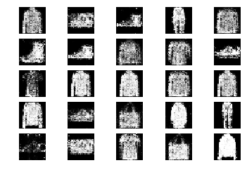

# MNIST-GAN

This is a solution to use GAN on MNIST Fashion data. The colab notebook location is

https://nbviewer.jupyter.org/github/jayant2014/MNIST-GAN/blob/master/GAN_Fashion_MNIST_1000_Sample.ipynb

After 10000 epochs, I get following images.

